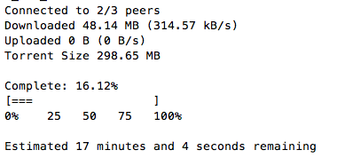

# torrent

[](https://nodei.co/npm/torrent/)

Download torrents from the command line



## usage

```
torrent <magnet link OR path to .torrent file>

  Download a torrent from a magnet link to torrent file.

torrent create <directory OR file> {-o outfile.torrent}

  Create a torrent file from a directory or file.

  If an output file isn't specified with `-o`, the torrent file will be
  written to stdout.

torrent seed <torrent file>

  Seed a torrent file.

torrent info <torrent file>

  Print information about a .torrent file to stdout as JSON.

torrent ls OPTIONS <torrent file>

  List all the files in a .torrent file.

  OPTIONS are like the `ls` command:

    -s  Show file sizes in bytes alongside file paths.
    -h  Show file sizes in human units when `-s` is on.

```

### download a torrent

e.g. to download ubuntu 14.04 ISO

```
torrent "magnet:?xt=urn:btih:4d753474429d817b80ff9e0c441ca660ec5d2450&dn=Ubuntu+14.04+64+bit&tr=udp%3A%2F%2Ftracker.openbittorrent.com%3A80&tr=udp%3A%2F%2Ftracker.publicbt.com%3A80&tr=udp%3A%2F%2Ftracker.istole.it%3A6969&tr=udp%3A%2F%2Fopen.demonii.com%3A1337"
```

or via .torrent file:

```
torrent ubuntu-14.04.iso.torrent
```

it will print progress:

```
$ torrent ubuntu-14.04.iso.torrent
1 file(s) in torrent
ubuntu-14.04.iso
Connected to 35/37 peers
Downloaded 5.47 MB (1.09 MB/s) with 0 hotswaps
Uploaded 0 B (0 B/s)
```

### create a torrent

You can create a torrent file with `torrent create`:

```
mkdir xyz; echo beep > xyz/a.txt; echo boop > xyz/b.txt
torrent create xyz/ -o xyz.torrent
```
